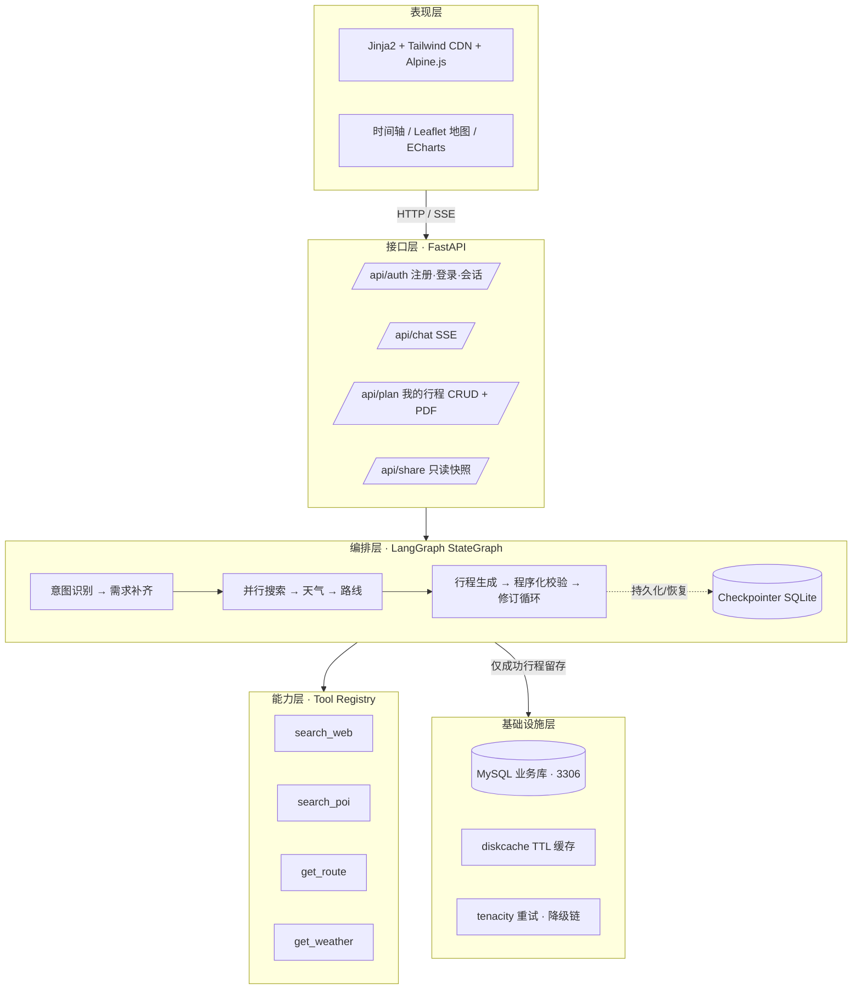

# 智能旅游规划 Agent

> 用自然语言说出旅行需求，Agent 自动检索真实网络信息、查询天气、校验路线可行性，产出**可溯源、可视化、可多轮修改**的行程单。

纯 Python 技术栈：**FastAPI + LangGraph + Pydantic v2 + Jinja2 服务端渲染**，无 Node 构建链；业务数据存 **MySQL**（`127.0.0.1:3306`，root/1234），登录注册内置，API Key 全部走环境变量。

## 核心特性

- 🧑‍💼 **账号体系**：注册 / 登录 / 登出（bcrypt 密码哈希 + HttpOnly Session Cookie，库里只存 token 哈希）；所有业务端点需登录，"我的行程"按用户隔离
- 🗣️ **自然语言规划**：「下个月去成都玩 4 天，预算 5000，爱吃辣，不想太累」→ 完整逐日行程
- 🔎 **事实可溯源**：景点 / 餐厅 / 交通均来自搜索与地图 Provider 返回，每条事实挂来源链接，禁止编造
- 🌦️ **天气驱动编排**：降水概率 > 60% 自动改排室内项目；超预报窗口使用历史气候均值并明确标注
- 🧩 **局部定向修改**：「第 2 天改轻松点，去掉一个景点」只改命中天数，其余字节级保持不变，并返回 PlanDiff
- 🗺️ **可视化行程单**：时间轴 + Leaflet 动线地图 + ECharts 费用图表，支持浏览器打印导出 PDF（Ctrl+P → 另存为 PDF）、生成只读分享链接
- 💬 **SSE 流式过程**：实时看到 Agent 的思考、工具调用与进度（正在查询第 3 天天气…）
- 💾 **只留存成功旅程**：生成成功的行程自动在主页"我的行程"与数据库双留存；chitchat / 开放问答不留存
- 🧠 **会话内记忆**：分批次补充时间 / 地点 / 人数等信息，跨轮累计到同一份需求，无需一次说完
- ✏️ **我的行程管理**：主页抽屉实时查看 / 打开 / 删除已生成的行程（增删改查）
- 🔁 **会话可恢复**：LangGraph Checkpointer（SQLite）持久化，刷新/重启后继续对话，版本可回滚
- 🛡️ **降级链设计**：Tavily→博查→DuckDuckGo（免 Key）、和风→Open-Meteo（免 Key）；地图默认高德（OSM 兜底实现保留，网络可达时一行配置开启）；统一超时/重试与分能力 TTL 缓存
- 🔑 **密钥不明文**：`LLM_API_KEY` 等全部经 `.env` 环境变量注入、`SecretStr` 承载，代码与日志中不出现密钥明文

## 架构总览



## 启动操作指南（Windows 本机实测）

前置条件：Python 3.13+、[uv](https://docs.astral.sh/uv/)（uv 会自动拉取匹配的 Python 3.13）以下命令均在本项目根目录下执行。

### 第 1 步 · 准备数据库（首次）

```sql
-- 用 MySQL 客户端（如 MySQL Workbench / mysql CLI）执行：
CREATE DATABASE travel_agent CHARACTER SET utf8mb4 COLLATE utf8mb4_unicode_ci;
```

测试库可一并创建：`CREATE DATABASE travel_agent_test ...`（pytest 使用，自动建表）。

### 第 2 步 · 安装依赖（首次或依赖变更后）

```powershell
uv sync
# PDF 自动导出为预留能力（暂未启用）；当前版本用浏览器打印导出 PDF，无需额外依赖
```

### 第 3 步 · 配置环境变量（首次）

```powershell
copy .env.example .env
```

编辑 `.env` 填入密钥：`LLM_API_KEY` 是 Agent 规划核心能力（必需）；`AMAP_API_KEY`（地图/POI）、`TAVILY_API_KEY`（搜索）、`QWEATHER_API_KEY`（天气）可选，缺失时自动降级。数据库连接默认即 `root:1234@127.0.0.1:3306`，如需改密码改 `DATABASE_URL`。**密钥只放 `.env`，代码与日志不出现明文。**

### 第 4 步 · 初始化数据库（首次）

```powershell
uv run python scripts/init_db.py     # 等价 alembic upgrade head，幂等，可重复执行
```

### 第 5 步 · 启动服务

```powershell
# 开发模式（热重载，推荐）
uv run python -m uvicorn travel_agent.main:app --reload --host 127.0.0.1 --port 8000
# 生产模式
uv run python -m uvicorn travel_agent.main:app --host 0.0.0.0 --port 8000
```

> ⚠️ **Windows 注意**：若执行 `uv run uvicorn ...`（或 `make dev`）报 `Failed to spawn: uvicorn / 应用程序控制策略已阻止此文件 (os error 4551)`，是系统应用控制策略拦截了 `.venv\Scripts\uvicorn.exe`；改用上面的 `uv run python -m uvicorn ...` 方式即可（本机实测可用，Makefile 已同步更新）。

### 第 6 步 · 验证与访问

| 入口 | 地址 | 预期结果 |
|---|---|---|
| 对话页（先注册/登录） | http://127.0.0.1:8000/ | HTTP 200，未登录时展示登录/注册卡片 |
| 我的行程 | 对话页右上角「我的行程」 | 展示本人已生成行程，可打开/删除 |
| API 文档 | http://127.0.0.1:8000/docs | HTTP 200 |
| 健康探针 | http://127.0.0.1:8000/healthz | `{"status":"ok","version":"0.1.0"}` |

停止服务：在运行服务的终端按 `Ctrl+C`。

### 环境自检（可选）

```powershell
uv run python -m travel_agent.doctor            # 检查 Python/依赖/Key/目录
uv run python -m travel_agent.doctor --online   # 追加外部服务连通性检查
```

### Docker 一键启动（可选）

```bash
docker compose up --build -d
```

## 目录说明

| 路径 | 职责 |
|---|---|
| `src/travel_agent/api/` | FastAPI 路由（含认证 `routes_auth.py`）、SSE、统一错误模型、依赖 |
| `src/travel_agent/agent/` | LangGraph 状态图、节点、工具（阶段三） |
| `src/travel_agent/services/` | 搜索/天气/地图 Provider、降级链、重试、TTL 缓存（阶段二）；正文抽取/PDF 导出（预留） |
| `src/travel_agent/domain/` | 纯业务模型与规则，禁止 IO |
| `src/travel_agent/db/` | SQLAlchemy 模型（用户/会话/会话记忆/行程）、会话、仓储（MySQL 业务库 + SQLite checkpointer） |
| `src/travel_agent/templates` `static/` | 服务端渲染页面与静态资源（阶段五），登录/注册与"我的行程"交互（阶段七） |
| `migrations/` | Alembic 迁移（0001 基础表 / 0002 用户与会话 / 0003 行程归属用户） |
| `prompts/` | Jinja2 提示词模板（阶段三） |
| `scripts/` | `init_db.py`（Alembic 建表）、`seed_demo.py`（演示数据） |
| `tests/` | unit / integration（respx mock）/ e2e |
| `docs/` | 架构、环境、运维、接口、提示词文档 |

## 开发常用命令

```bash
make dev        # 热重载开发（Windows 无 make 时执行 uv run python -m uvicorn ...）
make lint       # ruff check
make format     # ruff format + 自动修复
make typecheck  # mypy --strict
make test       # pytest
make cov        # 覆盖率报告
make doctor     # 环境自检
```

## 常见问题

- **没有任何 API Key 能跑吗？** 能启动、能看健康检查与文档；Agent 规划需要 `LLM_API_KEY`。搜索与天气分别有 DuckDuckGo / Open-Meteo 免 Key 兜底，地图 POI 无 Key 时会降级为文本搜索。
- **登录后"我的行程"是空的？** 属正常：本设计**只留存生成成功的旅程**，chitchat / 开放问答不会留下记录。去和小T多轮对话生成行程后即出现。
- **报「登录状态无效 / 已过期」？** Session Cookie 默认 7 天过期；重新登录即可。
- **报「Table 'travel_agent.xxx' doesn't exist」？** 未执行建表，按上文第 4 步运行 `uv run python scripts/init_db.py`。若库不存在，先建库（见第 1 步）。
- **启动时报「应用程序控制策略已阻止此文件 (os error 4551)」？** 这是 Windows 应用控制策略拦截了 `.venv` 中的 `uvicorn.exe`，改用 `uv run python -m uvicorn travel_agent.main:app --reload` 启动即可（详见上文「启动操作指南」）。
- **必须用 DeepSeek 吗？** 不必。任何 OpenAI 兼容服务（通义千问、智谱 GLM、Moonshot、OpenAI）改 `LLM_BASE_URL` / `LLM_MODEL` 即可。
- **为什么不用 Vue/React？** 服务端渲染 + Alpine.js 足以覆盖交互，保持纯 Python 技术栈、部署即静态文件；未来确有复杂 SPA 需求时再迁移（见 docs/ARCHITECTURE.md ADR-002）。

更多见 [docs/SETUP.md](docs/SETUP.md) 与 [docs/RUNBOOK.md](docs/RUNBOOK.md)。

## 路线图

- [x] 阶段一 · 骨架：工程配置 / 配置系统 / 日志 / FastAPI 空壳 / doctor / 文档初稿
- [x] 阶段二 · 能力层：Tavily/Bocha/DuckDuckGo 搜索、和风/Open-Meteo 天气（含超窗气候参考）、高德/OSM 地图，统一降级链 + tenacity 重试 + 分能力 TTL 缓存 + respx 离线单测
- [x] 阶段三 · Agent：LangGraph 状态图与 8 节点、6 工具（扇出限流/降级留痕）、结构化输出 + 校验失败回灌重试、rules 程序化校验-修订循环、SQLite checkpointer（TypedJSON 白名单序列化）、`plan` CLI、成都 4 天 fixture 端到端
- [x] 阶段四 · 多轮修改：modify_plan → patch_plan 定向修改、PlanDiff（compute_diff 纯函数）、版本回滚（rollback CLI）、偏好记忆（PreferenceRepository）
- [x] 阶段五 · 可视化：Jinja2 SSR 页面（对话/行程/分享）、SSE 流式事件、Leaflet 地图、ECharts 费用饼图、PlanDiff 变更说明、只读分享快照（token+可选过期）、行程版本 API + 回滚 HTTP 端点
- [x] 阶段六 · 加固：Dockerfile 多阶段构建 + docker-compose + CI（ruff/mypy/pytest 覆盖率门槛 70%）+ 演示数据脚本（`scripts/seed_demo.py` 成都 4 天 fixture）+ 文档终稿
- [x] 阶段七 · 账号与数据层：登录注册（bcrypt + HttpOnly Session Cookie）、业务库切换 MySQL（3306/root/1234）、会话内记忆回灌/写回、**仅成功旅程留存**、我的行程 CRUD（列表/打开/删除）、API Key 环境变量化、doctor MySQL 连通性检查

## 界面说明

- **对话页（/）**：进入即见登录/注册卡片；登录后输入自然语言需求（如「成都4天 预算5000 爱吃辣」），SSE 流式展示规划进度与结果，支持多轮修改；生成成功的行程自动出现在右上角「我的行程」
- **我的行程（右上角抽屉）**：本人已生成行程列表（目的地/日期/天数/预算），支持打开详情与删除；"规划一段新旅程"回到对话
- **行程页（/plan/{plan_id}）**：头部显示人均约花费与总花费（若设预算一并显示）；逐日时间轴 + Leaflet 地图标记 + ECharts 费用饼图 + 版本历史与回滚；导出 PDF：使用浏览器打印（Ctrl+P → 目标选「另存为 PDF」）
- **分享页（/share/{token}）**：只读行程展示，通过 API 生成不可猜测 token 分享给好友

## 许可证

[MIT](LICENSE)
