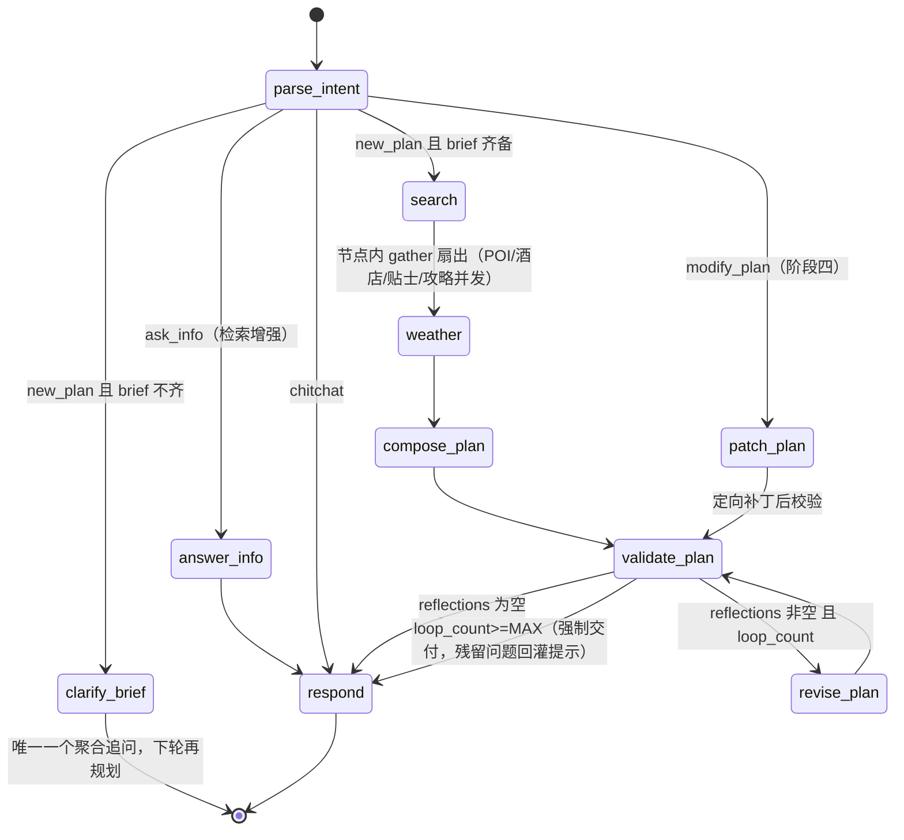
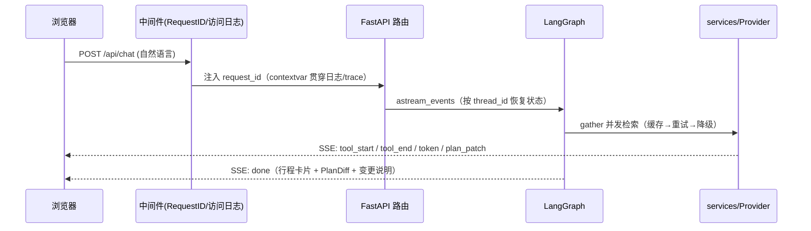

# 架构设计

> 随阶段推进持续更新（最后更新：阶段八 · 存档编辑与 AI 优化）。

## 1. 分层职责

| 层 | 目录 | 职责 | 纪律 |
|---|---|---|---|
| 表现层 | `templates/` `static/` | Jinja2 SSR + Tailwind(CDN) + Alpine.js + Leaflet + ECharts | 不引入 Node 构建链 |
| 接口层 | `api/` | 参数校验、SSE、**鉴权（Session Cookie，已实装）**/限流、统一错误信封 | 不写业务逻辑，只转发 |
| 编排层 | `agent/` | LangGraph 状态图：意图→补齐→检索→天气→生成→校验→修订 | 节点不直接发 HTTP，只调 `services/` |
| 能力层 | `services/` `agent/tools/` | Provider 抽象、降级链、tenacity 重试、TTL 缓存、正文抽取、PDF | `services/` 不感知 LLM |
| 领域层 | `domain/` | `TripPlan / Day / Item / POI / DailyWeather` 模型与规则、PlanDiff | 纯 Python，禁止 IO 与上层 import |
| 基础设施 | `db/` `config.py` `logging_conf.py` | SQLAlchemy/Alembic（**MySQL 业务库** + SQLite checkpointer）、配置、日志、diskcache、trace | — |

跨层数据契约：**外部响应一律先转 Pydantic 模型再进 Agent，禁止裸 dict 在层间传递**。

### 1.1 账户与数据留存（阶段七）

- **认证**（[`api/routes_auth.py`](../src/travel_agent/api/routes_auth.py)）：注册/登录/登出/`me`。密码 bcrypt 哈希入库；登录签发 `secrets.token_urlsafe(32)` 随机 token，库里只存 SHA-256 哈希（[`api/deps.py`](../src/travel_agent/api/deps.py) 的 `hash_token`），token 经 HttpOnly Cookie 下发（`SameSite=lax`，默认 7 天 TTL）。
- **数据隔离**：`plans.user_id` 归属校验，`/api/plan` 系端点非本人一律 404。
- **只留存成功旅程**：对话流结束后（[`api/routes_chat.py`](../src/travel_agent/api/routes_chat.py) 的 `_persist`）仅当图上实际产出 `plan` 才写 `plans` 表；chitchat / 开放问答不产生行程、不写 `messages`。
- **会话内记忆**（[`api/routes_chat.py`](../src/travel_agent/api/routes_chat.py) 的 `_load_context`/`_persist`）：按 `(user_id, thread_id)` 在 `conversation_contexts` 表存累计 brief，支持时间/地点/人数分多轮分批补充，每轮回灌给模型并写回。

### 1.2 能力层落地结构（阶段二）

```
services/
├── errors.py          ProviderError / OutsideForecastWindow / AllProvidersFailed ...
├── http_client.py     统一 UA/超时/重定向的 httpx.AsyncClient 工厂
├── retry.py           tenacity：仅 408/429/5xx 与传输层错误重试（3 次指数退避）
├── cache.py           diskcache TTL 缓存（IO 全走 to_thread；故障静默降级直连）
├── base.py            Provider 协议 + run_chain（未配置跳过→单家重试→失败转移）
├── search/            tavily → bocha → duckduckgo（免 Key 兜底）
├── weather/           qweather → openmeteo（16 天窗口，超窗走 archive 去年同期气候参考）
└── maps/              amap（默认唯一）；osm 实现保留（Nominatim + Overpass + OSRM），
                       网络可达时经 MAPS_PROVIDER_CHAIN=amap,osm 开启免 Key 兜底
```

关键纪律：

- 重试只在 `run_chain` / `CachedMapsProvider` 层发生，Provider 自身一次请求即返回/抛出，职责不重叠。
- 气候参考必须显式标记 `is_climate_reference=True`，不得冒充实时预报；降水概率/UV 在归档数据中保持 None。
- 缓存键含 namespace + provider + 归一化参数；直接 pickle Pydantic 模型，命中不发生类型漂移。
- TTL：搜索 6h / 天气 1h / POI·地理编码 24h / 路线 7d；所有外部调用必须经统一超时与重试。

## 2. LangGraph 状态图

阶段三落地的实际图（[`agent/graph.py`](../src/travel_agent/agent/graph.py)）：



阶段四 `modify_plan` 路由到 `patch_plan`：该节点接收 `target_scope` + 既有行程，提示词约束 LLM 只调整命中范围，产出新 `PlanDraft` 经水合后由 `compute_diff` 记录结构化差异（`PlanDiff`），`plan_id` 保持稳定。patch 后进入正常校验-修订循环。

`ask_info` 路由到 `answer_info`（[`agent/nodes/answer_info.py`](../src/travel_agent/agent/nodes/answer_info.py)）：先按「问题 + brief 目的地」并发网页检索，把真实资料格式化进 `reply_hint`，再由 `respond` 按「拆解 2-4 个子问题 → 结构化建议 → 引导补充信息/生成行程」的提示词作答；检索失败降级为常识回答并提示出行前确认。闲聊 `chitchat` 不经检索直接到 `respond`。

状态（[`agent/state.py`](../src/travel_agent/agent/state.py)，全部通道可选、节点返回增量）：

```python
class TravelState(TypedDict, total=False):
    messages: Annotated[list[BaseMessage], add_messages]
    brief: TravelBrief  # 结构化需求，压缩时永不丢原文
    intent: Literal["new_plan", "modify_plan", "ask_info", "chitchat"]
    target_scope: list[str]  # 修改命中边界（阶段三识别，阶段四消费）
    candidates: dict[str, list[Poi]]  # attractions / restaurants / hotels
    web_results: list[SearchResult]
    weather: dict[str, DailyWeather]  # 键为 ISO 日期字符串（JSON 友好）
    city_location: GeoPoint | None
    plan: TripPlan | None
    plan_diff: PlanDiff | None  # 阶段四：patch 产出的结构化差异
    hydration_warnings: list[str]  # 水合期丢弃/截断/天数不一致提示
    plan_version: int
    reflections: list[str]  # validate 的程序化反馈
    loop_count: int
    traces: list[ToolTrace]  # 工具调用留痕与降级标记
    reply_hint: str
    reply: str
```

要点：

- **条件边而非硬编码循环**：校验失败带着程序化 `reflections` 回到 `revise_plan`，修订时 `plan_id` 保持不变（版本链身份稳定）；`loop_count >= MAX_REVISE_LOOPS` 强制跳出并把残留问题作为「未解决项」回灌给 `respond`。
- **防编造机制**：LLM 只产出「按候选编号点菜」的 `PlanDraft`，名称/坐标/来源 URL 一律由 `plan_builder.hydrate_plan` 按编号水合；无编号的自由条目（活动/交通/备注）不带坐标与来源。
- **并行扇出**：POI/酒店/贴士/攻略经节点内 `asyncio.gather` 并发，`ToolRegistry` 统一做信号量限流（`FANOUT_CONCURRENCY`）、高德 POI 1 QPS 节流（`POI_MIN_INTERVAL_S`）、异常吞掉记 degraded trace 并降级为空结果，**工具失败永不炸断图**。
- **Checkpointer**：SQLite（`data/checkpoints.db`）持久化全部状态。默认 msgpack serde 无法序列化嵌套 HttpUrl 的 Pydantic v2 模型，因此使用自建 `TypedJSONSerializer`（类型信封 + 白名单反序列化，拒绝任意类型导入与 pickle），见 [`agent/serde.py`](../src/travel_agent/agent/serde.py)。
- **结构化输出纪律**：意图与草稿均为 Pydantic 模型，解析失败自动重试一次并把校验错误原文回灌模型；两次失败抛 `LLMError`，CLI 退出码 1。

## 3. 多轮修改（项目最难点）

1. `parse_intent` 对每轮输入判定意图；修改类必须解析 `target_scope`。
2. Patch 模式：仅命中范围重新生成，未命中部分字节级不动；产出 `PlanDiff{added, removed, changed, reason}`。
3. 每次变更落 `plan_versions(plan_id, version, snapshot_json, diff_json, trigger_message_id, created_at)`。
4. 修改破坏约束（时间填不满/预算爆掉）时先给「影响说明」再追问确认，不静默执行。
5. 长期偏好写 `user_preference`，后续规划自动生效。
6. 上下文超阈值做摘要压缩；`brief` 与 `plan` 保留原文。

### 3.1 存档编辑与 AI 优化（阶段八）

已生成的存档支持两条「定向修改 → 实时新版本」路径（[`api/routes_plan.py`](../src/travel_agent/api/routes_plan.py)），回滚机制完全复用：

- **手动编辑 `PUT /api/plan/{plan_id}`**：提交编辑后的完整 `TripPlan`（前端允许改条目标题/时间/时长/费用/备注、增删条目）。领域纯函数 `apply_manual_edit`（[`domain/plan_edit.py`](../src/travel_agent/domain/plan_edit.py)）做骨架保护（目的地/起止日期/人数不可变）、天数与逐日日期对齐校验、`poi_id` 白名单校验、事实字段强制还原（坐标/来源以当前版本存量为准，伪造无效）、自由条目剥离坐标与来源、`item_id` 统一重编号；随后 `compute_diff` + `save_snapshot(trigger_message_id="edit:manual")` 写新版本；内容无变化则不写空版本（no-op）。
- **AI 优化 `POST /api/plan/{plan_id}/optimize`**：编排在 [`agent/optimize.py`](../src/travel_agent/agent/optimize.py)——`rebuild_catalog_from_plan` 反构候选目录（类目顺序 attraction→restaurant→hotel，无坐标/重复条目跳过）→ `instruction` 命中酒店/景点/餐厅关键词时按初始规划同款查询补充检索（共享 24h POI 缓存）→ 天气（获取失败降级为空，不阻断）→ `render_pair("optimize")` → `llm.aparse(PlanDraft)` → `hydrate_plan` 水合 → `evaluate_plan` 程序化自检（warnings 回传，不阻塞）→ `compute_diff`。LLM 仍只「按编号点菜」，事实字段由水合保证不编造；`plan_id` 保持稳定。
- 两条路径均以**递增版本号**写 `plan_versions`（`trigger_message_id` 为 `edit:manual` / `edit:optimize`，版本列表显示为「手动编辑」「AI 优化」），保存即成为实时最新方案，且随时可回滚。
- **依赖注入**：`get_llm`（未配置 Key 返回 `None` → 503）与 `get_tool_context`（ToolRegistry）经 [`api/deps.py`](../src/travel_agent/api/deps.py) 注入，集成测试用 `dependency_overrides` 整体替换为 FakeLLM / 内存替身。

## 4. 关键 ADR（架构决策记录）

### ADR-001：选 LangGraph 而非 AgentExecutor / 手写 Function Calling 循环
- **背景**：核心场景是「规划-搜索-校验-重排」显式循环 + 局部修改 + 中断恢复。
- **决策**：LangGraph StateGraph + 条件边 + Checkpointer + interrupt。
- **备选**：LangChain AgentExecutor（隐式循环、难定位修改边界）；Pydantic-AI（较新、checkpoint 生态弱）；手写 FC 循环（状态持久化与恢复全部自研）。
- **迁移成本**：中。节点均为普通 async 函数，迁出时节点函数可整体保留，仅替换图装配与 checkpointer（约 200 行）。

### ADR-002：Jinja2 SSR + Tailwind CDN + Alpine.js，不引入 Node 构建链
- **背景**：交互以展示与表单为主，团队为纯 Python 栈。
- **决策**：服务端渲染 + 轻量浏览器库；复杂状态用 Alpine 组件承载，SSE 推送过程。
- **备选**：Vue3+Vite（交互上限高，但引入 Node 工具链、双语言栈）。
- **迁移成本**：低-中。页面本就按组件化 partial 组织，将来可用 Vue 重写前端而不动 API。

### ADR-003：搜索/天气/地图 Provider 抽象 + 降级链
- **决策**：统一 `SearchProvider` / `WeatherProvider` / `MapsProvider` 协议，顺序由环境变量配置，tenacity 指数退避后切下一家。
- **理由**：免费额度有限、单点限流/故障会让 Agent 直接不可用；搜索/天气的 Open-Meteo / DuckDuckGo 免 Key 保证开箱跑通。
- **阶段二补充（地图默认链收窄）**：目标部署环境无法访问 OSM 公共端点（Nominatim/Overpass/OSRM），`MAPS_PROVIDER_CHAIN` 默认仅 `amap`，高德 Key 成为地图能力的事实必需项（doctor 缺失时 WARN 明确提示）。OSM 代码保留并持续测试，网络可达的环境改环境变量即可恢复 `amap,osm` 兜底，无需改代码。
- **备选**：单一 Provider（接入简单但脆弱）。迁移成本：新增 Provider 只需实现协议并登记，零改动。

### ADR-004：SQLite + LangGraph SQLite Checkpointer 起步（阶段二被 ADR-007 收窄）
- **原决策**：开发零部署；生产仅改 `DATABASE_URL` 切 PostgreSQL+asyncpg（SQLAlchemy 2.0 屏蔽差异）。
- **阶段二修订**：根据项目定位（单机本地/个人部署）明确**不引入 Postgres/Redis**，约束见 ADR-007。

### ADR-005：日志 loguru + structlog 双库
- loguru 负责落点与彩色可读性，structlog 负责上下文字段与 request_id 串联；生产 JSON 单行输出，可直接进 ELK/Loki。
- stdlib logging（uvicorn/sqlalchemy）经 `InterceptHandler` 汇入同一出口。

### ADR-006：PDF 用 Playwright(Chromium) 而非 WeasyPrint
- 行程单含地图瓦片/ECharts canvas，真实浏览器打印保真度最高；与页面共用同一套模板与打印样式。代价是镜像体积大，因此用可选 extra + 构建参数控制。
- **当前状态**：自动导出尚未启用（`POST /api/plan/{plan_id}/pdf` 为占位，返回 503 提示浏览器打印）；用户可通过浏览器打印（Ctrl+P → 另存为 PDF）导出。

### ADR-007：单机 MySQL 业务库 + SQLite Checkpointer（明确不做水平扩展）
- **背景**：阶段二确认产品形态为单机/个人部署，数据量与并发都不是瓶颈，多进程一致性与运维成本不值得承担（当时定 SQLite）；阶段七引入账号体系后，业务库按需求切换为 **MySQL**（`127.0.0.1:3306`，root/1234），SQLite 仅保留给 LangGraph checkpointer。
- **决策**：
  - 业务库为 **MySQL**（`mysql+aiomysql` 异步驱动，库 `travel_agent`，utf8mb4）；本机默认连接串见 `.env` 的 `DATABASE_URL`，表结构由 Alembic 迁移维护（迁移走同步 `pymysql` 驱动，见 `_to_sync_url`）。
  - LangGraph checkpointer 仍为独立 SQLite 文件（`CHECKPOINT_DB=./data/checkpoints.db`），与业务库互不影响；WAL 特性作用于该 checkpoint 文件。
  - 运行约束：**单进程、单 uvicorn worker**（SQLite checkpointer 不支持多进程写）；不支持多实例水平扩展、不支持跨机共享会话。
  - 缓存用本地 diskcache，不引入 Redis。
- **升级触发条件**：出现多用户并发写冲突、需要多副本部署或数据量接近单机磁盘上限时，重新评审引入 PostgreSQL/独立 checkpointer 存储（SQLAlchemy 层已预留，应用代码不写数据库专有 SQL）。
- **备份**：业务库用 mysqldump 定时备份；checkpointer/缓存直接备份 `./data` 目录。

### ADR-008：LLM 固定 DeepSeek（OpenAI 兼容协议，可替换不改代码）
- **决策**：默认 `LLM_BASE_URL=https://api.deepseek.com/v1`、`LLM_MODEL=deepseek-chat`，经 langchain-openai 的 OpenAI 兼容客户端接入。
- **理由**：中文行程规划质量/成本比好；兼容协议意味着换 Qwen、Kimi、本地 vLLM 等只需改环境变量，Agent 代码不绑定厂商。
- **纪律**：禁止在代码中硬编码厂商私有参数；提供商专属特性（如前缀缓存、上下文缓存）在工具层按 base_url/model 做键区分，不污染领域模型。
- **超时纪律**：LLM 客户端使用独立的 `LLM_TIMEOUT`（默认 120s）；长文本生成（行程草稿数千 token）实测 9-24s，禁止复用面向工具接口的 `EXTERNAL_TIMEOUT`（10s 级会在高峰期误杀每次调用）。

### ADR-009：分享链接 = 无鉴权只读快照 + 不可猜测 token（阶段五实现）
- **决策**：分享不做账号体系；生成时冻结行程快照（plan_versions 同一版本的 JSON），URL 携带 ≥128 位随机 token（`secrets.token_urlsafe`），仅支持 GET 只读访问。
- **可选增强**：快照支持过期时间（TTL，到期 410）；不提供列举页、不提供编辑入口；撤销 = 删除 token 映射行。
- **边界**：拿到链接即持有阅读权，因此 token 不出现在日志/trace；私密行程默认不自动开启分享。

### ADR-010：金额固定 CNY 展示，不引入汇率服务
- **决策**：`DEFAULT_CURRENCY=CNY`，全部预算/费用以人民币展示；不接入任何汇率换算服务。
- **理由**：单机个人部署，汇率服务增加外部依赖与故障面；Provider 返回的外币价格本身稀疏且不可靠。
- **纪律**：拿到外币金额时保留原始币种标注，不做静默换算（静默换算反而制造虚假精确）。

## 5. 请求生命周期



## 6. 安全与成本原则

- 系统提示与用户内容严格分隔；用户输入限长并做注入特征校验。
- 分享链接使用不可猜测 token + 只读快照；`.env` 永不入库；日志 `diagnose=False` 防密钥随堆栈外泄。
- 缓存优先（搜索 6h / POI 24h / 天气 1h / 路线 7d），并行扇出，限制 `max_results`，trace 记录 token 与调用次数。
